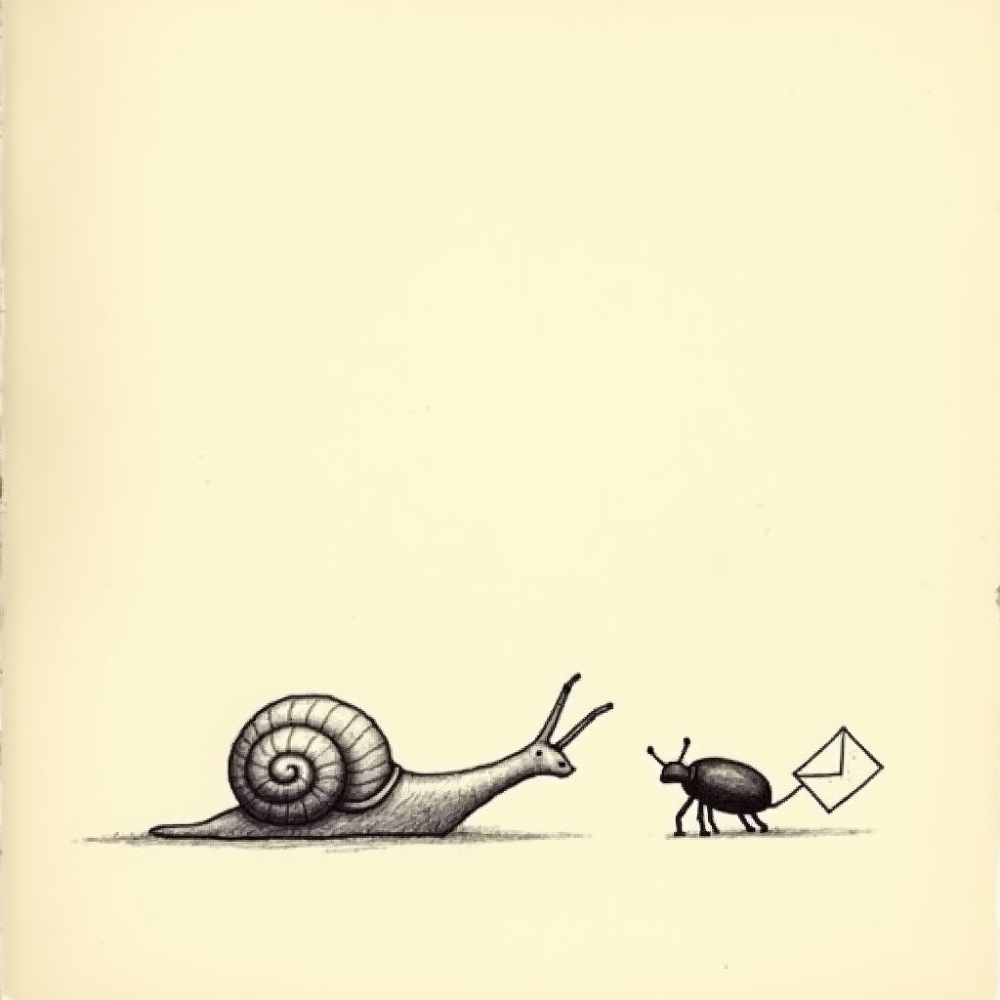

# slime-line — Project Diary

*Phase-by-phase log. Entries append, never rewrite. Nothing is done until its wall is green twice.*

---
## 2026-09-22 13:19 — Milestone 0 — the brief

Humboldt Jam, Slugs n' Bugs: a tilt-glide slug leaving glowing slime, letter-bugs to chase and eat, target words for multipliers, salt to fear. Art set generated; the slug core is building.

## 2026-09-22 13:28 — Lore recovered

A found document from the world (see LORE.md) and its sketch now live in this repo's diary_images. Oddworld law: the game's instructions are artifacts of its own world.

